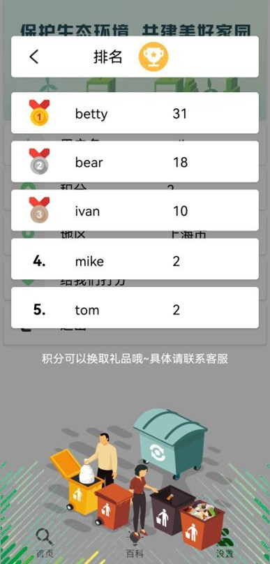

# WhichBin 是什么垃圾
*智能识别，精准分类——让垃圾分类更简单*

## 📱 应用概述
WhichBin 是一款基于 Android 平台的智能垃圾分类助手，采用 Kotlin 开发，支持上海市和成都市的分类标准（其他地区尽情期待）。通过图像识别、文字搜索和互动学习功能，帮助用户快速准确分类垃圾。

## ✨ 核心功能
### 1. 用户认证模块
| 登录界面 | 注册界面 |
|---------|---------|
|  |  |
| - 手机号/密码登录<br>- 第三方账号快捷登录 | - 手机号验证注册<br>- 用户协议确认 |

### 2. 核心功能模块
| 实时识别 | 图像识别流程 |
|---------|-------------|
|  |  |
| 摄像头实时分类垃圾 | 拍照→裁剪→反馈全流程 |

### 3. 百科与学习
| 百科首页 | 答题互动 |
|---------|---------|
|  |  |
| 分类标准图文详解 | 卡牌式答题赚积分 |

### 4. 设置与管理
| 城市切换 | 积分排名 |
|---------|---------|
|  |  |
| 支持上海/成都双标准 | 社区积分排行榜 |

### 项目架构
```
app/src/main/
├── assets/ # 静态资源
│ ├── best.bin # ncnn模型权重文件
│ ├── best.param # ncnn模型结构文件
│ └── synset.txt # 分类标签文件
│
├── java/com/example/whichbin/
│ ├── classification/   # 图像分类核心模块
│ ├── database/         # 本地数据库操作
│ ├── http/             # 网络请求封装
│ ├── Login/            # 登录注册模块
│ └── ui/               # 界面相关
│ ├── ActivityCollector # 活动管理器
│ ├── BaseActivity      # 基础Activity
│ ├── CircleImageView   # 自定义圆形图片控件
│ ├── MainActivity      # 主界面
│ ├── UserData.kt       # 用户数据模型
│ └── WelcomeActivity   # 欢迎页
│
├── jni/ # 本地代码（C++）
│ └── ncnn-20220216-android/ # ncnn框架文件（已.gitignore忽略）
│ ├── CMakeLists.txt         # CMake构建脚本
│ ├── mobileNet_jni.cpp      # JNI接口实现
│ └── ts.id.h                # 头文件
│
├── res/                      # 资源目录
│   ├── drawable/             # 通用图片资源
│   ├── drawable-v24/         # API 24+专用资源
│   ├── layout/               # XML布局文件
│   ├── menu/                 # 菜单定义文件
│   ├── mipmap-*/             # 多密度图标资源（hdpi~xxxhdpi）
│   ├── navigation/           # Navigation组件路由定义
│   ├── values/               # 通用资源配置
│   │   ├── colors.xml        # 颜色定义
│   │   ├── strings.xml       # 字符串定义
│   │   └── styles.xml        # 主题样式
│   ├── values-night/         # 深色模式资源
│   └── xml/                  # 其他XML配置
│
├── AndroidManifest.xml       # 应用清单文件
├── build.gradle              # 模块级构建脚本
└── proguard-rules.pro        # 混淆规则文件
opencv/
├── build.gradle
└── 其他文件                  #已.gitignore忽略
```

## 🧩 核心模块说明

### 1. 模型部署层
- ​**ncnn 模型**​  
  - `best.bin` + `best.param`：部署在assets的轻量级分类模型MobileNetV2
  - JNI层通过`mobileNet_jni.cpp`调用模型
  - CMake构建配置：`CMakeLists.txt`

### 2. 业务逻辑层
| 模块          | 关键类/文件               | 功能说明                     |
|---------------|--------------------------|----------------------------|
| ​**图像分类**​  | `classification/`        | 封装ncnn模型调用接口         |
| ​**数据持久化**| `database/` + `UserData.kt` | SQLite操作及用户数据模型     |
| ​**网络通信**​  | `http/`                  | Retrofit/OkHttp请求封装      |

### 3. 表现层
- ​**Activity 架构**​  
  ```kotlin
  BaseActivity ← MainActivity/WelcomeActivity
  ActivityCollector：统一管理所有Activity生命周期
  CircleImageView：自定义View实现圆形头像
### 环境要求
```
Android Studio Electric Eel 2021.1+
Android SDK 33+
NDK 25+（ncnn 支持）
```
## ⚙️ 技术栈组合

层级	技术方案
​模型推理​	ncnn + JNI + CMake
​数据管理​	SQLite + Room（可选）
​网络通信​	Retrofit2 + OkHttp3
​UI框架​	AndroidX + Material Design

### 调用的开源包
```
easypermissions-3.0.0
retrofit-2.6.0
ncnn-20220216-android
opencv-4.3.0-android-sdk
UCrops-2.2.10
...
```
## 📸 效果演示
